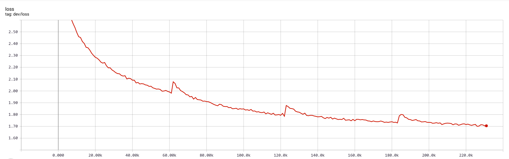
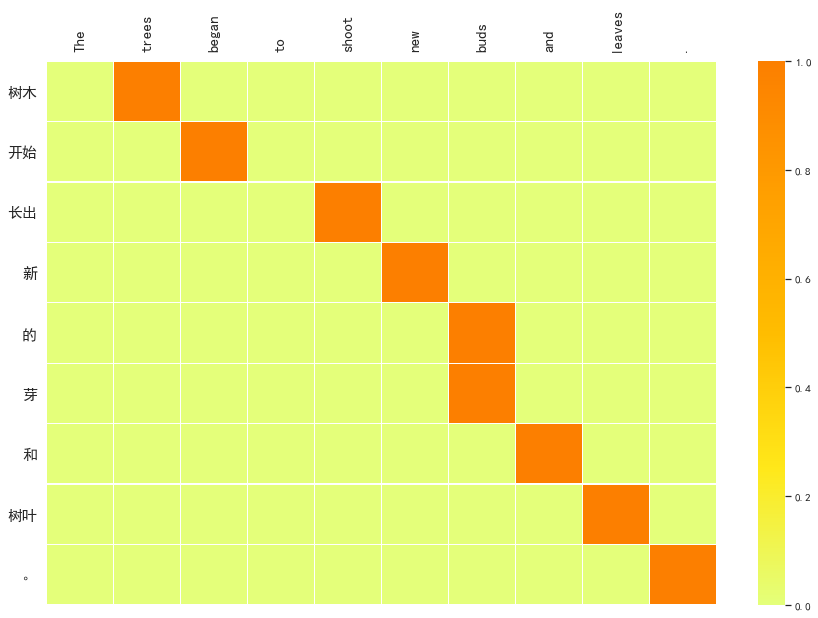
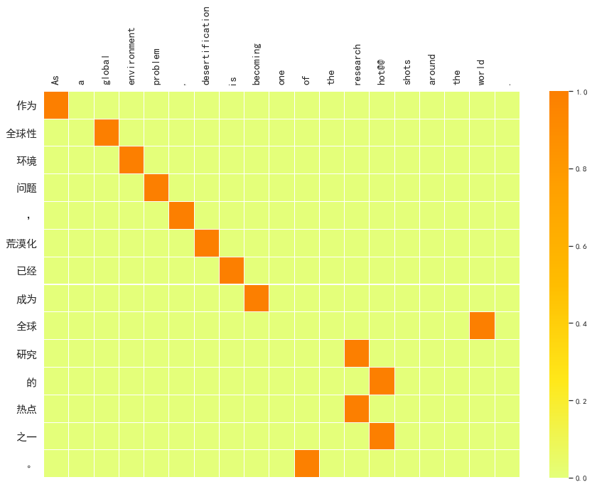
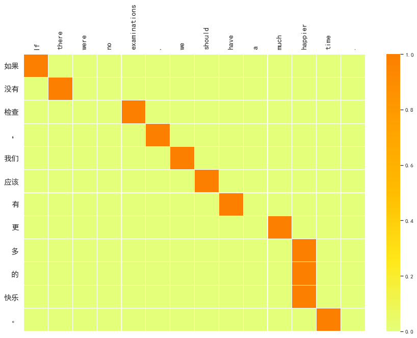

# Neural Machine Translation

Pytorch implementation of Neural Machine Translation with seq2seq and attention (en-zh) (英汉翻译)

This repo reaches 10.44 BLEU score in my test dataset.(Use [multi-bleu.perl](https://github.com/moses-smt/mosesdecoder/blob/master/scripts/generic/multi-bleu.perl)). 


## Introduction 

The goal of machine translation is to maximize p(**y**|**x**). Due to the infinite space of language, directly estimating this conditional probability is impossible. Thus neural networks, which are good at fitting complex functions, are introduced into machine translation. 

[Sutskever et. al 2014](http://papers.nips.cc/paper/5346-sequence-to-sequence-learning-with-neural-networks.pdf) proposed a model consisting of encoder and decoder, named `seq2seq`. Once proposed, it set off a tornado in NMT. A number of follow-up work began (e.g. [Cho et. al](https://arxiv.org/abs/1406.1078)). One of the most famous work is the `attention` mechanism ([Bahdanau et. al 2014](https://arxiv.org/abs/1409.0473)).

In this repo, I implemented the seq2seq model with attention in PyTorch for en-zh translation. 

## Requirements

python 3.6

- PyTorch>=0.4
- torchtext
- nltk
- jieba
- subword-nmt

## Usage

First, run

```shell
./preprocess.sh
```

to tokenize and do BPE.

Then run `nmt.ipynb` for training and testing.

Lastly, BLEU score is calculated by
```
perl multi-bleu.perl references.txt < predictions.txt
```

Pretrained model can be found [here](https://pan.baidu.com/s/1uakEdYMX8bTNum7Jx1Z90w). (passwd:ukvh)

## Data

neu2017 from [CWMT corpus 2017](http://nlp.nju.edu.cn/cwmt-wmt/)


2 million parallel sentences (enzh)

98% of data is for training, the other for validating and testing.

## Preprocessing

- tokenizer
    - zh: jieba
    - en: nltk.word_tokenizer
- BPE: [subword-nmt](https://github.com/rsennrich/subword-nmt) (For the parameter `num_operations`, I choose 32000.)


It is worth mentioning that `BPE` reduced the vocabulary significantly, from 50000+ to 32115.

Besides, \<sos> and \<eos> symbols are conventionally prepended to each sentences. OOV is represented with \<unk>. 

One problem in my training is that the vocabulary of Chinese is so large that I only took those the top 50k most frequent, which results in many \<unk> in my training dataset. Too many \<unk> in many training dataset has bad influence in my model when training.  My model prefers to predict \<unk> as well. So I just ignore \<unk> when predicting.


## Model Architecture (seq2seq)

Similar to [Luong et. al 2015](https://arxiv.org/abs/1508.04025). 


- embeddings: [glove](https://nlp.stanford.edu/projects/glove/)  (en)&  [word2vec](https://github.com/Embedding/Chinese-Word-Vectors) (zh)  (both 300-dim)
- encoder: 4-layer Bi-GRU (hidden-size 1000-dim)
- decoder: 4-layer GRU with attention (hidden-size 1000-dim)
- attention: bilinear global attention

According to [Chung, J. et. al 2014](https://arxiv.org/pdf/1412.3555), GRU can reach similar performance as LSTM. So I chose GRU.

## Training details

Hypter-Params:

- optim: Adam
- lr: 1e-4
- no L2 regularization (Since there is no obvious overfitting)
- dropout: 0.3
- clip gradient norm: 0.5
- warm-up: fix embeddings before 1 epoch

validation loss:

(The periodic bulge is because I reset optimizer every epoch. It is not necessary.)

Perplexity reaches 5.5 in validation dataset.

Trained 231K steps, nearly 4 epochs

I found that training is a bit slow. However, some parameters including attention parameters can not be tuned well with larger learning rate.


## Beam Search

According to [wikipedia](https://en.wikipedia.org/wiki/Beam_search), beam search is BFS with width constraints. 

Google's [GNMT paper](https://arxiv.org/abs/1609.08144) gave two refinements to the beam search algorithm: a coverage penalty and length normalization. The coverage penalty formula they proposed is so empirical that I just use length normalization.
But I found that this method did not perform very well. I got 9.23 BLEU which is less than 10.44 which normal beam search algorithm reached.


## Visualization

Alignment visualizations:








## References

- Sutskever, I., Vinyals, O. and Le, Q.V., 2014. [Sequence to sequence learning with neural networks](http://papers.nips.cc/paper/5346-sequence-to-sequence-learning-with-neural-networks.pdf). In *Proceedings of NIPS 2014*.  ([Citation](https://scholar.google.com/scholar?cites=13133880703797056141&as_sdt=2005&sciodt=0,5&hl=en): 5,780)


- Cho, K., Van Merriënboer, B., Gulcehre, C., Bahdanau, D., Bougares, F., Schwenk, H. and Bengio, Y., 2014. [Learning phrase representations using RNN encoder-decoder for statistical machine translation](https://arxiv.org/pdf/1406.1078). In *Proceedings of EMNLP 2014*.  ([Citation](https://scholar.google.com/scholar?cites=9119975171114587835&as_sdt=2005&sciodt=0,5&hl=en): 4,411)

- Bahdanau, D., Cho, K. and Bengio, Y., 2014. [Neural machine translation by jointly learning to align and translate](https://arxiv.org/pdf/1409.0473). In *Proceedings of ICLR 2015*. ([Citation](https://scholar.google.com/scholar?cites=9430221802571417838&as_sdt=2005&sciodt=0,5&hl=en): 5,933)

- Luong, M.T., Pham, H. and Manning, C.D., 2015. [Effective approaches to attention-based neural machine translation](https://arxiv.org/pdf/1508.04025). In *Proceedings of EMNLP 2015*. ([Citation](https://scholar.google.com/scholar?cites=12347446836257434866&as_sdt=2005&sciodt=0,5&hl=en): 1,550)

- Wu, Y., Schuster, M., Chen, Z., Le, Q.V., Norouzi, M., Macherey, W., Krikun, M., Cao, Y., Gao, Q., Macherey, K. and Klingner, J., 2016. [Google's neural machine translation system: Bridging the gap between human and machine translation](https://arxiv.org/pdf/1609.08144.pdf%20(7)). In *Proceedings of NIPS 2016*. ([Citation](https://scholar.google.com/scholar?cites=17018428530559089870&as_sdt=2005&sciodt=0,5&hl=en): 1,046)

- Sennrich, R., Haddow, B. and Birch, A., 2015. [Neural machine translation of rare words with subword units](https://arxiv.org/pdf/1508.07909). In *Proceedings of ACL 2016*. ([Citation](https://scholar.google.com/scholar?cites=1307964014330144942&as_sdt=2005&sciodt=0,5&hl=en): 789)

- Press, O. and Wolf, L., 2016. [Using the output embedding to improve language models](https://arxiv.org/pdf/1608.05859). In *Proceedings of EACL 2017*. ([Citation](https://scholar.google.com/scholar?cites=3142797974561089298&as_sdt=2005&sciodt=0,5&hl=en): 139) 

- Zhou, J., Cao, Y., Wang, X., Li, P. and Xu, W., 2016. [Deep recurrent models with fast-forward connections for neural machine translation](https://www.mitpressjournals.org/doi/pdf/10.1162/tacl_a_00105). In *Proceedings of TACL 2016*. ([Citation](https://scholar.google.com/scholar?cites=2319930273054317494&as_sdt=2005&sciodt=0,5&hl=en): 75)

- Chung, J., Gulcehre, C., Cho, K. and Bengio, Y., 2014. [Empirical evaluation of gated recurrent neural networks on sequence modeling](https://arxiv.org/pdf/1412.3555). In *Proceedings of NIPS 2014*.  ([Citation](https://scholar.google.com/scholar?cites=8949247111056306593&as_sdt=2005&sciodt=0,5&hl=en): 2,197)


